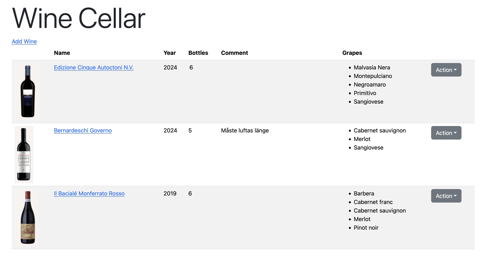

# Wine Cellar

Used to keep track of wines. 


## Docker
Run the published version on GitHub.
Store the database in a sub directory (`data`).
```
docker run --restart=always -p20000:20000 \
  -v $(pwd)/data:/app-dir/data \
  --name=wine-cellar -d ghcr.io/fredrik-jansson-se/wine-cellar:main
```

Build
```
docker buildx build -t wine-cellar --load
```
